# **Automation Test Framework Documentation**

## **Author**
👤 **Krishna Chaithanya**  
📧 [krishnachaithanyavattikonda@gmail.com](mailto:krishnachaithanyavattikonda@gmail.com)  
🔗 [LinkedIn](https://www.linkedin.com/in/krishna-chaithanya-vattikonda/) | [GitHub](https://github.com/krishnachaithanyavattikonda)


## **Flowchart - Test Automation Framework Execution Flow**



---

## **Flow Breakdown**
### **1. Test Execution Flow**
- `TestRunner (TestNG)` starts execution and passes environment parameters.
- It triggers the test suites: **cp, dp1, dp2**.
- Each suite contains `StepDefinitions`, which initialize the required `Page` objects.

### **2. Page Object Model (POM)**
- `StepDefinitions` create instances of `Pages`, which extend `BasePage.java`.
- `BasePage.java` uses `PageFactory.initElements()` to initialize Web Elements.

### **3. Core Framework Components**
- `BasePage.java`: Manages WebDriver and PageFactory.
- `DriverManager.java`: Manages WebDriver instances and fetches the correct environment.
- `ConfigReader.java`: Loads configurations from `Config.properties`.
- `Hooks.java`: Handles `@Before`, `@After`, and logging setup (`LogUtil`).

### **4. Utilities Layer**
- Includes `CsvUtil`, `FileUtil`, `LogUtil`, `SeleniumUtil`, `TestDataUtil`, etc.
- These provide helper methods for file operations, logging, and Selenium actions.

### **5. Resource Management**
- `Config.properties`: Stores environment configurations.
- `log4j2.xml`: Configures logging.
- `features/`: Contains Cucumber feature files.
- `data/`: Holds test data files.

---

## **Setup Instructions**
### **Prerequisites**
- Java **(Latest LTS version)**
- Maven **(Latest version)**
- TestNG
- WebDriver (ChromeDriver, GeckoDriver, etc.)
- Cucumber dependencies

### **Installation**
1. Clone the repository:
   ```
   git clone <repository-url>
   ```
2. Navigate to the project directory:
   ```
   cd automation-framework
   ```
3. Install dependencies:
   ```
   mvn clean install
   ```

---

## **Running Tests**
### **Run All Test Suites**
```
mvn test -DsuiteXmlFile=src/test/resources/testng.xml
```

### **Run Individual Test Suites**
```
mvn test -DsuiteXmlFile=src/test/resources/dp1/testng.xml
```
Replace `dp1` with `cp` or `dp2` to run other test suites.

---

## **Parallel Execution**
TestNG is configured for parallel execution. The `testng.xml` file dynamically sends the environment parameter, which is handled in `DriverManager.java`.

---

## **Logging & Reports**
- **Logging**: Configured using `LogUtil.java` and `log4j2.xml`
- **Reports**: Generated by TestNG after execution.

---

## **Conclusion**
This framework is **modular, scalable, and maintainable**, supporting **multiple test suites and parallel execution**.

---
